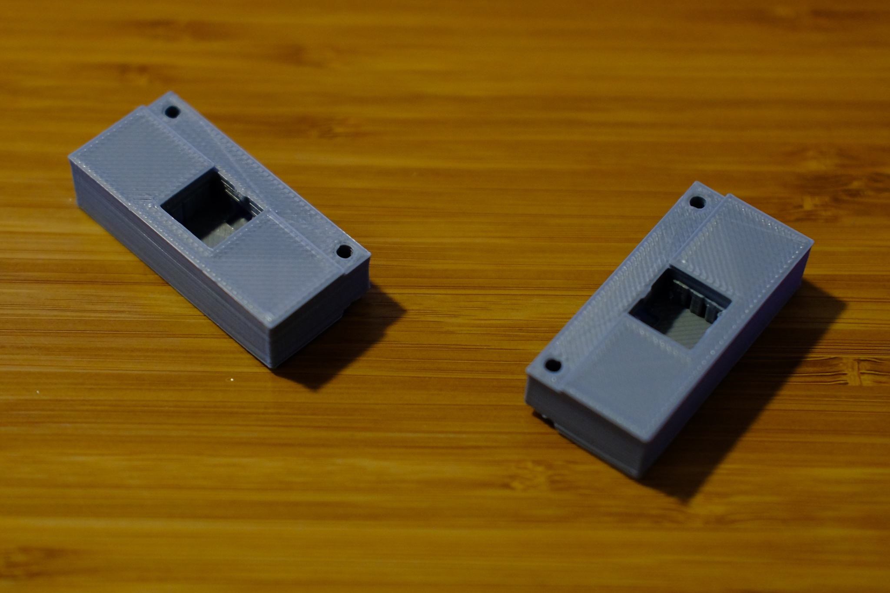
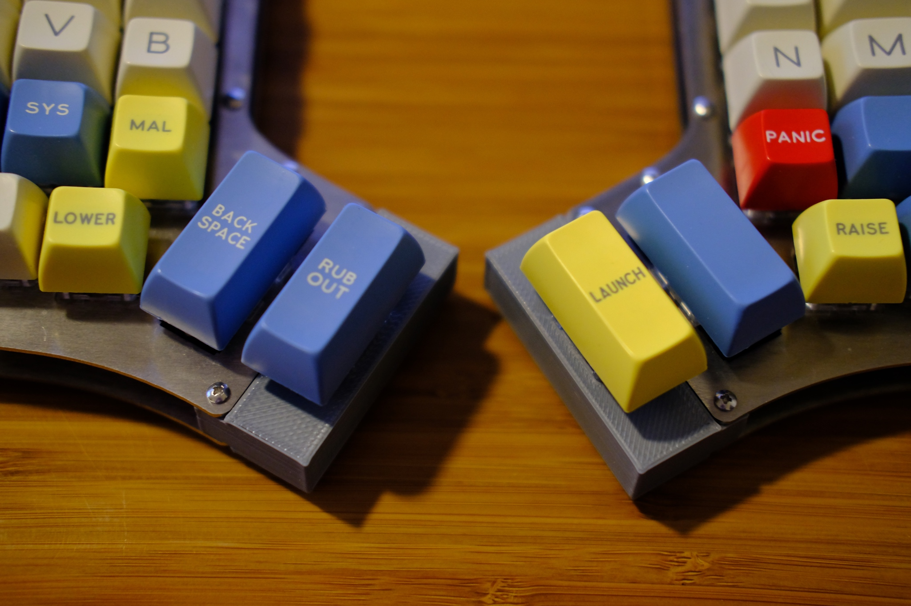
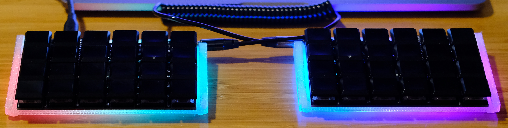

# Keyboards

I like making keyboards, and 3D printing things, and functional programming.
This is a collection of scripts using my Elixir library, [open_scad]
(https://github.com/joedevivo/open_scad) to make keyboardy CAD models for
printing with [OpenSCAD](http://www.openscad.org/)

This project is for my own tinkering, but also to serve as an example of the
`open_scad` library.

## Running

First off, build it like any other Elixir project with `mix do deps.get,
compile`. 

`iex -S mix` will kick off a process that watches `./models` for file
changes, and will then run them through the `open_scad` library. Since OpenSCAD
will rerender on file changes, just by saving an Elixir script in the models
directory, you'll see changes to the model in OpenSCAD thanks to the
`OpenSCAD.Watcher` GenServer.

## The Iris Helper

The
[Iris](https://keeb.io/collections/keyboard-pcbs/products/iris-keyboard-split-ergonomic-keyboard)
is a split 50% ergonomic keyboard sold by [Keeb.io](https://keeb.io). I
personally couldn't give up on the two 2u thumb keys on each hand, so I designed
and printed these little "helpers" which you can find at
[iris_helper.exs](./models/iris_helper.exs).

 
Iris Helpers on their own
  

Iris Helpers, Assembled

## The Divide Case

The
[Divide](https://www.reddit.com/r/MechanicalKeyboards/comments/7o06yb/low_profile_lets_split_version_b/)
is a low-profile variant of the [Let's
Split](https://github.com/nicinabox/lets-split-guide) designed by
[/u/SouthPawEngineer](https://www.reddit.com/user/SouthPawEngineer). The kit I
bought came with 4 PCBs. Two for the actual matrix, and two to act as bottom
plates. It seemed like a waste to use those PCBs for bottom plates, so I built a
low profile plate for them. That allowed me to print them at an angle to account
for the Pro Micros' height in the back with a little angle that wouldn't defeat
the purpose of a low profile board in the first place. Then I got the bright (ha
ha) idea to print it with t-glase, and put an RBG light strip underneath,
lighting up the whole case.

Backlit Glory

## The WIP Dactyl

The [Dactyl](https://github.com/adereth/dactyl) keyboard is pretty dope, but the
thumb clusters put strain on my inner thumb over time. This is my WIP port from
clojure, so I can really wrap my head around it before making changes.

